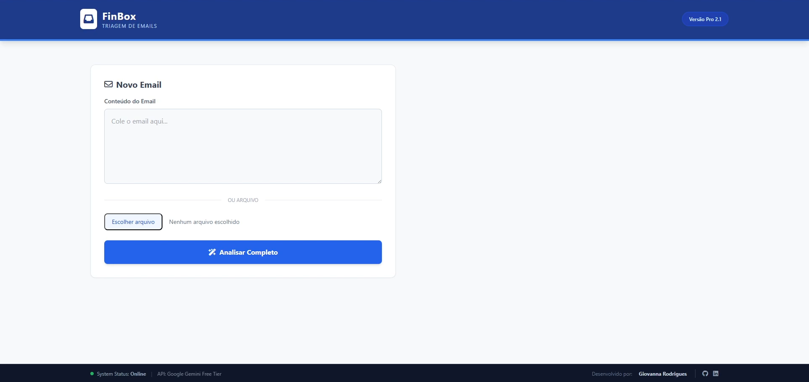
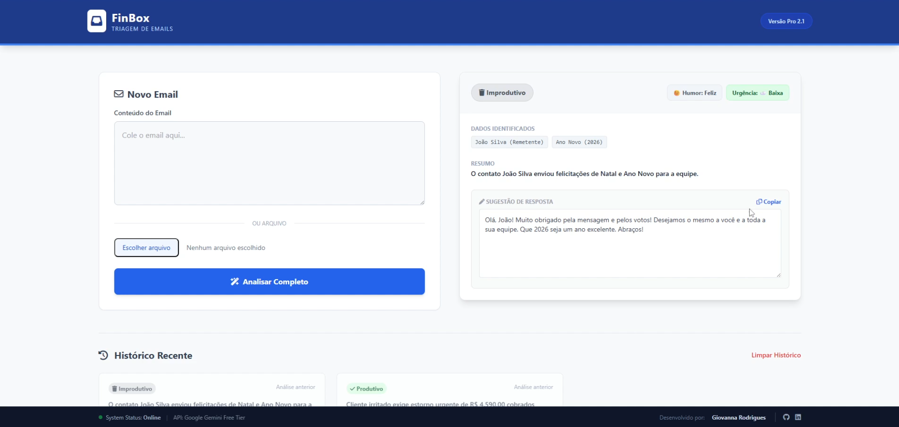
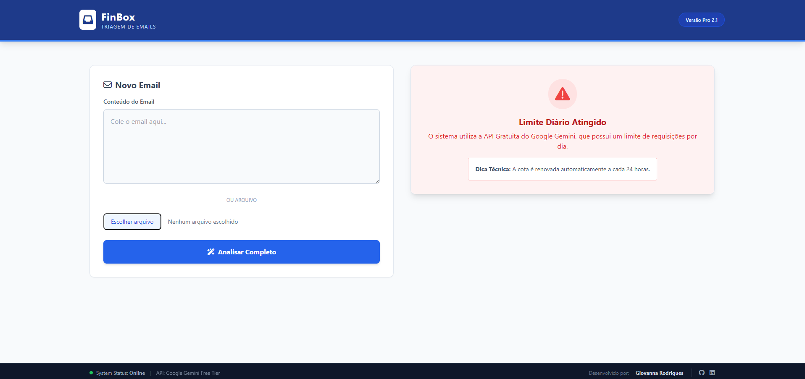

# 🏦 FinBox — Triagem Inteligente de Emails com IA


> **FinBox** é uma solução de Inteligência Artificial desenvolvida como **desafio técnico**, focada em **automatizar a triagem de emails em instituições financeiras**, reduzindo esforço operacional e melhorando a experiência da equipe.

O sistema utiliza **IA generativa + NLP** para classificar emails, analisar sentimento e urgência, extrair dados relevantes e gerar **minutas de resposta prontas**, sempre mantendo o humano no controle.

---

## 🎯 Problema

Equipes financeiras lidam diariamente com **alto volume de emails**, misturando:

* demandas reais de clientes
* mensagens sociais
* notificações automáticas e spam

Esse cenário gera:

* perda de tempo em triagens manuais
* atraso em atendimentos críticos
* desgaste operacional da equipe

---

## 💡 Solução

O **FinBox** atua como uma camada inteligente de pré-atendimento:

* 📥 recebe emails (texto ou arquivo)
* 🧠 interpreta contexto, sentimento e urgência
* 🏷️ classifica automaticamente
* ✍️ sugere respostas formais e adequadas
* 🧑‍💼 permite edição humana antes do envio

Tudo isso com foco em **clareza visual, feedback imediato e UX simples**.

---

## 🔗 Links Rápidos

* 🌐 **Aplicação Online (Deploy em Nuvem):**
  👉 *[adicione aqui o link do Render]*

---

## 📸 Demonstração da Interface

### Inserção de Email


### Classificação Produtiva


### Email Improdutivo


### Tratamento de Erros


---

## 🚀 Funcionalidades Principais

* **Classificação Inteligente**

  * Produtivo vs. Improdutivo (social, spam, notificações)
* **Análise de Sentimento**

  * Feliz 😊 | Neutro 😐 | Irritado 😠
* **Detector de Urgência**

  * Alta 🔥 | Média ⚡ | Baixa ☁️
* **Extração de Dados Relevantes**

  * CPF, valores monetários e datas, com contexto
* **Resumo Automático**

  * Uma frase para leitura rápida
* **Geração de Resposta**

  * Minuta formal, editável antes de copiar
* **UX/UI**

  * Interface *Split View* (email à esquerda, análise à direita)
  * Feedback visual semafórico
* **Resiliência**

  * Tratamento amigável de erros e limites de API (não quebra a tela)

---

## ⚠️ Limitações da API (Free Tier)

Este projeto utiliza a **API do Google Gemini (Modelo 1.5 Flash)** no plano gratuito.

Por conta das **cotas diárias**, a aplicação pode exibir:

> **“Limite diário da API atingido (Erro 429)”**

🔎 Importante:

1. Isso **não é erro de código**
2. A exceção é tratada no backend
3. O frontend exibe um card explicativo e amigável
4. A cota é renovada automaticamente em até 24h

O código permanece totalmente funcional para avaliação técnica.

---

## 🧪 Exemplos de Teste

Você pode validar rapidamente a solução usando os cenários abaixo:

### 📌 Cliente Irritado (Produtivo)

```
Estou indignado! Já mandei meus documentos três vezes.
Meu CPF é 123.456.789-00.
Se não resolverem essa cobrança de R$ 5.000,00 hoje, vou processar o banco!
```

### 📌 Email Social (Improdutivo)

```
Bom dia equipe!
Passando apenas para desejar um Feliz Natal e um ótimo Ano Novo.
Abraços!
```

### 📌 Notificação Automática (Improdutivo)

```
Seu alerta de vagas para Estagiário de TI.
Novas oportunidades correspondem ao seu perfil no LinkedIn.
```

---

## ⚙️ Execução Local

Caso queira rodar o projeto localmente:

### 1️⃣ Clone o repositório

```bash
git clone https://github.com/SEU_USUARIO/finbox-triagem.git
cd finbox-triagem
```

### 2️⃣ Crie e ative o ambiente virtual

```bash
python -m venv venv
# Windows
venv\Scripts\activate
# Linux/Mac
source venv/bin/activate
```

### 3️⃣ Instale as dependências

```bash
pip install -r requirements.txt
```

### 4️⃣ 🔐 Variáveis de Ambiente

Crie um arquivo `.env` na raiz do projeto:

```env
GOOGLE_API_KEY=Sua_Chave_Google_Gemini
FLASK_SECRET_KEY=Uma_Chave_Segura_Para_Sessao
```

Caso a variável FLASK_SECRET_KEY não seja definida, a aplicação utiliza uma chave padrão apenas para desenvolvimento local.

### 5️⃣ Execute a aplicação

```bash
python app.py
```

Acesse em:
👉 [http://127.0.0.1:5000](http://127.0.0.1:5000)

---

## 🛠️ Stack Tecnológica

* **Backend:** Python, Flask
* **Frontend:** HTML5, TailwindCSS (via CDN)
* **IA / NLP:** Google Gemini 1.5 Flash API
* **Deploy:** Render Cloud

---

## 👩‍💻 Autoria

Desenvolvido por **Giovanna Rodrigues**
Projeto criado como desafio técnico, com foco em **engenharia prática, UX e produtividade real**.
